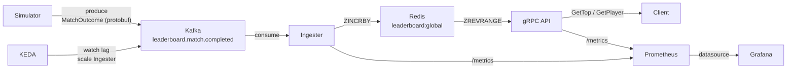

# Realtime Leaderboard

A real-time leaderboard system built with Go, Kafka, Redis, and gRPC.

Match outcomes are produced to Kafka, consumed and scored by an ingester, and exposed via a gRPC read API backed by a Redis sorted set. The system runs locally via Docker Compose and in Kubernetes via kind, with full observability through Prometheus and Grafana, and event-driven autoscaling via KEDA.

**Scoring:** win +3 / draw +1 / loss −1

## Architecture



| Component  | Role                                                              |
|------------|-------------------------------------------------------------------|
| Simulator  | Produces random 1v1 match outcomes to Kafka every second         |
| Ingester   | Consumes outcomes, updates player scores in Redis via `ZINCRBY`  |
| API        | gRPC server — reads leaderboard state from Redis sorted set      |
| Prometheus | Scrapes `/metrics` from both services                            |
| Grafana    | Dashboards for ingester throughput and API latency               |
| KEDA       | Scales the ingester horizontally based on Kafka consumer lag     |

## Tech stack

| Technology | Purpose |
|------------|---------|
| Go 1.24 | All services |
| Kafka 3.9 (KRaft) | Message bus for match outcomes |
| Redis 7 | Sorted set for leaderboard state |
| gRPC + Protobuf | Read API |
| Prometheus | Metrics collection |
| Grafana | Metrics dashboards |
| KEDA | Event-driven autoscaling |
| Docker Compose | Local development |
| Kubernetes (kind) | Container orchestration |
| GitHub Actions | CI/CD — test on PR, build and push images on merge |
| k6 | Load testing |

## Prerequisites

### All platforms

| Tool      | Version | Install |
|-----------|---------|---------|
| Go        | 1.24+   | [go.dev/dl](https://go.dev/dl) |
| Docker    | any     | [docs.docker.com/get-docker](https://docs.docker.com/get-docker/) |
| Buf CLI   | latest  | See below |
| grpcurl   | latest  | See below |
| kind      | latest  | See below |
| kubectl   | latest  | See below |
| Helm      | 3+      | See below |
| k6        | latest  | See below |

### Windows (Scoop)

Install [Scoop](https://scoop.sh) first, then:

```powershell
scoop install make
scoop install buf
scoop install grpcurl
scoop install kind
scoop install kubectl
scoop install helm
scoop install k6
```

### macOS / Linux

```bash
brew install bufbuild/buf/buf grpcurl kind kubectl helm k6
```

## Local development (Docker Compose)

### 1. Start infrastructure

```bash
make up
```

Starts Kafka (KRaft), Redis, Prometheus, and Grafana.

| Service    | URL                        |
|------------|----------------------------|
| Prometheus | http://localhost:9090      |
| Grafana    | http://localhost:3000 (admin/admin) |

### 2. Generate protobuf code

```bash
make proto
```

Runs `buf generate` and writes Go files to `gen/`. This directory is gitignored — regenerate whenever `.proto` files change.

### 3. Run the services

Open three separate terminals:

```bash
# Terminal 1 — ingest match outcomes from Kafka into Redis
make ingester

# Terminal 2 — produce random match outcomes to Kafka
make simulator

# Terminal 3 — serve the gRPC API
make api
```

### 4. Query the API

```bash
# Top 10 players
grpcurl -plaintext -proto api/leaderboard/v1/leaderboard.proto \
  -d '{"limit": 10}' \
  localhost:50051 leaderboard.v1.LeaderboardService/GetTop

# Single player lookup
grpcurl -plaintext -proto api/leaderboard/v1/leaderboard.proto \
  -d '{"player_id": "<uuid>"}' \
  localhost:50051 leaderboard.v1.LeaderboardService/GetPlayer

# Raw Redis inspect (top 10)
make top10
```

`make api` builds with `-tags dev`, which enables gRPC reflection. With reflection active you can omit `-proto`:

```bash
grpcurl -plaintext -d '{"limit": 10}' localhost:50051 leaderboard.v1.LeaderboardService/GetTop
```

> **Note:** gRPC reflection is disabled in production builds (the Docker images). Always pass `-proto api/leaderboard/v1/leaderboard.proto` when querying the Kubernetes deployment.

### 5. Tear down

```bash
make down
```

## Kubernetes (kind)

### 1. Create a local cluster

```bash
kind create cluster
```

### 2. Install KEDA

```bash
helm repo add kedacore https://kedacore.github.io/charts
helm repo update
helm install keda kedacore/keda --namespace keda --create-namespace
```

### 3. Install kube-prometheus-stack

```bash
helm repo add prometheus-community https://prometheus-community.github.io/helm-charts
helm repo update
helm install kube-prometheus-stack prometheus-community/kube-prometheus-stack \
  --namespace monitoring \
  --create-namespace
```

### 4. Deploy the stack

```bash
kubectl apply -R -f kubernetes/
```

This deploys Redis, Kafka, the ingester, and the gRPC API — each with a Deployment, Service, and ConfigMap. The ingester also gets a KEDA ScaledObject and a Prometheus ServiceMonitor.

### 5. Verify all pods are running

```bash
kubectl get pods
kubectl get pods -n monitoring
```

### 6. Query the API

```bash
kubectl port-forward svc/leaderboard-api-service 50051:50051

grpcurl -plaintext -proto api/leaderboard/v1/leaderboard.proto \
  -d '{"limit": 10}' \
  localhost:50051 leaderboard.v1.LeaderboardService/GetTop
```

### 7. Access Grafana

```bash
kubectl port-forward -n monitoring svc/kube-prometheus-stack-grafana 3000:80
```

Open http://localhost:3000. Retrieve the admin password:

```bash
kubectl get secret -n monitoring kube-prometheus-stack-grafana \
  -o jsonpath="{.data.admin-password}" | base64 --decode
```

Import the dashboard from `observability/grafana/provisioning/dashboards/leaderboard.json` via **Dashboards → New → Import**.

### 8. Produce test messages

The simulator runs locally and connects to Kafka via a port-forward. First, add `kafka` to your hosts file:

**Windows** — edit `C:\Windows\System32\drivers\etc\hosts` as administrator:
```
127.0.0.1 kafka
```

**macOS / Linux** — edit `/etc/hosts`:
```
127.0.0.1 kafka
```

Then in two terminals:

```bash
# Terminal 1 — forward Kafka into the cluster
kubectl port-forward svc/kafka 9092:9092

# Terminal 2 — run the simulator
KAFKA_URL=kafka:9092 KAFKA_TOPIC=leaderboard.match.completed go run ./cmd/simulator
```

## Load testing

Ensure the gRPC API is reachable (port-forward if using kind), then:

```bash
k6 run k6/script.js
```

The script ramps up to 10 virtual users, sustains load for 30 seconds, then ramps down. Thresholds: p95 latency < 100ms, 99% check pass rate.

## CI/CD

| Workflow   | Trigger       | What it does |
|------------|---------------|--------------|
| `ci.yml`   | Pull request  | `go vet` + `go test` |
| `release.yml` | Push to `main` | Builds and pushes `api` and `ingester` images to GHCR, tagged with `latest` and the commit SHA |

Images are published at `ghcr.io/reach-will/realtime-leaderboard/api` and `ghcr.io/reach-will/realtime-leaderboard/ingester`.

## Project layout

```
api/                          # Protobuf source definitions
  leaderboard/v1/
    leaderboard.proto
buf.yaml                      # Buf module config
buf.gen.yaml                  # Code generation config
cmd/
  api/
    main.go                   # gRPC API server
    Dockerfile
  ingester/
    main.go                   # Kafka consumer + Redis writer
    metrics.go                # Prometheus metric definitions
    Dockerfile
  simulator/
    main.go                   # Kafka producer
gen/                          # Generated Go code (gitignored)
internal/
  adminhttp/                  # Shared /metrics + /healthz HTTP server
  events/v1/
    match_outcome.proto       # Kafka event schema
  rediskeys/                  # Redis key constants
kubernetes/
  api/                        # API Deployment, Service, ConfigMap, ServiceMonitor
  ingester/                   # Ingester Deployment, Service, ConfigMap, ScaledObject, ServiceMonitor
  kafka/                      # Kafka Deployment, Service, ConfigMap
  redis/                      # Redis Deployment, Service
k6/
  script.js                   # gRPC load test
observability/
  prometheus.yml              # Prometheus scrape config (Docker Compose)
  grafana/provisioning/       # Grafana datasource + dashboard provisioning
.github/workflows/
  ci.yml
  release.yml
docker-compose.yml
Makefile
```

## Make targets

| Target           | Description                                    |
|------------------|------------------------------------------------|
| `make up`        | Start Kafka, Redis, Prometheus, Grafana        |
| `make down`      | Stop and remove containers                     |
| `make proto`     | Regenerate gRPC code from `.proto`             |
| `make api`       | Run the gRPC API server (with dev reflection)  |
| `make ingester`  | Run the Kafka → Redis ingester                 |
| `make simulator` | Run the match outcome producer                 |
| `make topic`     | Create Kafka topic manually (optional)         |
| `make top10`     | Inspect top 10 scores directly in Redis        |
| `make ps`        | Show running Docker Compose services           |
