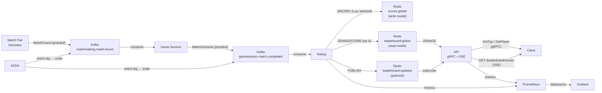

# Realtime Leaderboard

A real-time leaderboard system built with Go, Kafka, Redis, and gRPC.

Players are paired by a matchmaking simulator, game outcomes are resolved by a game session service, scores are updated by a rating service via batched atomic Redis operations, and the leaderboard is streamed to clients over gRPC and SSE. The system runs locally via Docker Compose and in Kubernetes via kind, with full observability through Prometheus and Grafana, and event-driven autoscaling via KEDA.

**Scoring:** win +3 / draw +1 / loss −1

## Architecture



| Component           | Role                                                                                       |
|---------------------|--------------------------------------------------------------------------------------------|
| Match Pair Simulator | Produces random `MatchFound` events (1 per second) to `matchmaking.match.found`           |
| Game Session        | Consumes `MatchFound`, resolves a random outcome, produces `MatchOutcome` to `gamesession.match.completed` |
| Rating              | Consumes `MatchOutcome` in batches, updates player scores in Redis via an atomic Lua script |
| API                 | Serves gRPC (`GetTop`, `GetPlayer`) and SSE (`GET /leaderboard/stream`) backed by Redis   |
| Prometheus          | Scrapes `/metrics` from Rating and API services                                            |
| Grafana             | Dashboards for rating throughput and API latency                                           |
| KEDA                | Scales Game Session and Rating independently based on Kafka consumer lag                   |

### Data flow

```
MatchFound  →  matchmaking.match.found  →  Game Session  →  MatchOutcome
           →  gamesession.match.completed  →  Rating
           →  Redis scores:global (write model)
           →  Redis leaderboard:global (read model, top-10 snapshot)
           →  Redis leaderboard:updated (pub/sub → SSE hub → browser)
```

### Redis data model

| Key                   | Type        | Purpose                                              |
|-----------------------|-------------|------------------------------------------------------|
| `scores:global`       | Sorted set  | Source of truth — all player scores                 |
| `matches:processed`   | Set         | Match IDs used for at-least-once deduplication      |
| `leaderboard:global`  | Sorted set  | Top-10 read model, projected after every rating flush |
| `leaderboard:updated` | Pub/sub     | Notifies the SSE hub when the read model changes    |

### Kafka topics

| Topic                             | Partitions (k8s) | Producer          | Consumer     |
|-----------------------------------|------------------|-------------------|--------------|
| `matchmaking.match.found`         | 300              | Match Pair Simulator | Game Session |
| `gamesession.match.completed`     | 300              | Game Session      | Rating       |
| `matchmaking.match.found.dlt`     | 1                | Game Session      | —            |
| `gamesession.match.completed.dlt` | 1                | Rating            | —            |

Dead letter topics (`.dlt`) receive poison pills (malformed messages) and, temporarily, transient failures from the rating service until a dedicated retry topic is in place.

## Tech stack

| Technology | Purpose |
|------------|---------|
| Go 1.24 | All services |
| Kafka 3.9 (KRaft) | Event bus for match events |
| Redis 7 | Sorted sets for scores; pub/sub for SSE notifications |
| gRPC + Protobuf | Read API (`GetTop`, `GetPlayer`) |
| SSE (HTTP) | Real-time leaderboard stream for browser clients |
| Prometheus | Metrics collection |
| Grafana | Metrics dashboards |
| KEDA | Event-driven autoscaling based on Kafka consumer lag |
| Docker Compose | Local development |
| Kubernetes (kind) | Container orchestration |
| GitHub Actions | CI/CD — test on PR, build and push images on merge |
| k6 | Load testing |

## Prerequisites

### All platforms

| Tool      | Version | Install |
|-----------|---------|---------|
| Go        | 1.24+   | [go.dev/dl](https://go.dev/dl) |
| Docker    | any     | [docs.docker.com/get-docker](https://docs.docker.com/get-docker/) |
| Buf CLI   | latest  | See below |
| grpcurl   | latest  | See below |
| kind      | latest  | See below |
| kubectl   | latest  | See below |
| Helm      | 3+      | See below |
| k6        | latest  | See below |

### Windows (Scoop)

Install [Scoop](https://scoop.sh) first, then:

```powershell
scoop install make
scoop install buf
scoop install grpcurl
scoop install kind
scoop install kubectl
scoop install helm
scoop install k6
```

### macOS / Linux

```bash
brew install bufbuild/buf/buf grpcurl kind kubectl helm k6
```

## Local development (Docker Compose)

### 1. Start infrastructure

```bash
make up
```

Starts Kafka (KRaft), Redis, Prometheus, and Grafana.

| Service    | URL                                |
|------------|------------------------------------|
| Prometheus | http://localhost:9090              |
| Grafana    | http://localhost:3000 (admin/admin) |

### 2. Generate protobuf code

```bash
make proto
```

Runs `buf generate` and writes Go files to `gen/`. This directory is gitignored — regenerate whenever `.proto` files change.

### 3. Run the services

Open terminals for each service you want to run:

```bash
# Rating service — consumes match outcomes from Kafka and updates Redis
make rating

# Game Session service — consumes MatchFound events, resolves outcomes, produces MatchOutcome
make gamesession

# Match Pair Simulator — produces one MatchFound event per second
make matchpairsimulator

# API server — serves gRPC + SSE
make api
```

**Typical local setup:** start the API and Rating services, then choose a producer:

- `make matchpairsimulator` + `make gamesession` — full pipeline (MatchFound → MatchOutcome → scores)
- `make matchoutcomesimulator` — bypass Game Session; produces MatchOutcome directly at 1 msg/s
- `make matchpairloadgen` / `make matchoutcomeloadgen` — high-throughput load generators

### 4. Query the API

```bash
# Top 10 players (gRPC)
grpcurl -plaintext -proto api/leaderboard/v1/leaderboard.proto \
  -d '{"limit": 10}' \
  localhost:50051 leaderboard.v1.LeaderboardService/GetTop

# Single player lookup (gRPC)
grpcurl -plaintext -proto api/leaderboard/v1/leaderboard.proto \
  -d '{"player_id": "<uuid>"}' \
  localhost:50051 leaderboard.v1.LeaderboardService/GetPlayer

# Real-time leaderboard stream (SSE)
curl -N http://localhost:8080/leaderboard/stream

# Raw Redis inspect (top 10)
make top10
```

`make api` builds with `-tags dev`, which enables gRPC reflection. With reflection active you can omit `-proto`:

```bash
grpcurl -plaintext -d '{"limit": 10}' localhost:50051 leaderboard.v1.LeaderboardService/GetTop
```

> **Note:** gRPC reflection is disabled in production builds (the Docker images). Always pass `-proto api/leaderboard/v1/leaderboard.proto` when querying the Kubernetes deployment.

### 5. Tear down

```bash
make down
```

## Kubernetes (kind)

### 1. Create a local cluster

```bash
kind create cluster
```

### 2. Install KEDA

```bash
helm repo add kedacore https://kedacore.github.io/charts
helm repo update
helm install keda kedacore/keda --namespace keda --create-namespace
```

### 3. Install kube-prometheus-stack

```bash
helm repo add prometheus-community https://prometheus-community.github.io/helm-charts
helm repo update
helm install kube-prometheus-stack prometheus-community/kube-prometheus-stack \
  --namespace monitoring \
  --create-namespace
```

### 4. Deploy the stack

```bash
kubectl apply -R -f kubernetes/
```

This deploys Redis, Kafka, the Kafka topics init job, Game Session, Rating, and the gRPC/SSE API — each with a Deployment, Service, and ConfigMap. Game Session and Rating each get a KEDA ScaledObject and a Prometheus ServiceMonitor. Kafka and Redis exporters are also deployed for Prometheus scraping.

### 5. Verify all pods are running

```bash
kubectl get pods
kubectl get pods -n monitoring
```

### 6. Query the API

```bash
kubectl port-forward svc/leaderboard-api-service 50051:50051 8080:8080

# gRPC
grpcurl -plaintext -proto api/leaderboard/v1/leaderboard.proto \
  -d '{"limit": 10}' \
  localhost:50051 leaderboard.v1.LeaderboardService/GetTop

# SSE
curl -N http://localhost:8080/leaderboard/stream
```

### 7. Access Grafana

```bash
kubectl port-forward -n monitoring svc/kube-prometheus-stack-grafana 3000:80
```

Open http://localhost:3000. Retrieve the admin password:

```bash
kubectl get secret -n monitoring kube-prometheus-stack-grafana \
  -o jsonpath="{.data.admin-password}" | base64 --decode
```

Import the dashboard from `observability/grafana/provisioning/dashboards/leaderboard.json` via **Dashboards → New → Import**.

### 8. Produce test messages

The simulators run locally and connect to Kafka via a port-forward. First, add `kafka` to your hosts file:

**Windows** — edit `C:\Windows\System32\drivers\etc\hosts` as administrator:
```
127.0.0.1 kafka
```

**macOS / Linux** — edit `/etc/hosts`:
```
127.0.0.1 kafka
```

Then in separate terminals:

```bash
# Terminal 1 — forward Kafka into the cluster
kubectl port-forward svc/kafka 9092:9092

# Terminal 2 — full pipeline: produce MatchFound events
KAFKA_ADDR=kafka:9092 \
MATCHMAKING_MATCH_FOUND_KAFKA_TOPIC=matchmaking.match.found \
go run ./cmd/matchpairsimulator

# Or bypass Game Session and produce MatchOutcome directly:
KAFKA_ADDR=kafka:9092 \
KAFKA_TOPIC=gamesession.match.completed \
go run ./cmd/matchoutcomesimulator
```

## Load testing

Ensure the gRPC API is reachable (port-forward if using kind), then:

```bash
k6 run k6/script.js
```

The script ramps up to 10 virtual users over 15 seconds, sustains load for 30 seconds, then ramps down. Thresholds: p95 latency < 100ms, 99% check pass rate.

## CI/CD

| Workflow      | Trigger       | What it does |
|---------------|---------------|--------------|
| `ci.yml`      | Pull request  | `go vet` + `go test` |
| `release.yml` | Push to `main` | Builds and pushes `api`, `gamesession`, and `rating` images to GHCR, tagged with `latest` and the commit SHA |

Images are published at:
- `ghcr.io/reach-will/realtime-leaderboard/api`
- `ghcr.io/reach-will/realtime-leaderboard/gamesession`
- `ghcr.io/reach-will/realtime-leaderboard/rating`

## Project layout

```
api/                              # Protobuf source definitions
  leaderboard/v1/
    leaderboard.proto             # GetTop / GetPlayer RPC
  matchmaking/v1/
    events.proto                  # MatchFound event
  gamesession/v1/
    events.proto                  # MatchOutcome event
buf.yaml                          # Buf module config
buf.gen.yaml                      # Code generation config
cmd/
  api/
    main.go                       # gRPC + SSE server
    Dockerfile
  gamesession/
    main.go                       # MatchFound → MatchOutcome pipeline stage
    Dockerfile
  rating/
    main.go                       # MatchOutcome → Redis score updater
    Dockerfile
  matchpairsimulator/
    main.go                       # Slow producer: 1 MatchFound/s
  matchpairloadgen/
    main.go                       # High-throughput MatchFound producer
  matchoutcomesimulator/
    main.go                       # Slow producer: 1 MatchOutcome/s (bypasses Game Session)
  matchoutcomeloadgen/
    main.go                       # High-throughput MatchOutcome producer (bypasses Game Session)
gen/                              # Generated Go code (gitignored)
internal/
  admin/                          # Shared /metrics + /healthz HTTP server
  config/                         # Shared env-var helper
  gamesession/                    # Game Session logic and config
  leaderboardservice/             # gRPC server, SSE handler, and Redis pub/sub hub
  matchpairsimulator/             # MatchFound producer logic
  matchpairloadgen/               # High-throughput MatchFound producer
  matchoutcomesimulator/          # MatchOutcome producer logic
  matchoutcomeloadgen/            # High-throughput MatchOutcome producer
  rating/                         # Kafka consumer, batched Redis writer, Lua script, metrics
  rediskeys/                      # Redis key constants
kubernetes/
  api/                            # API Deployment, Service, ConfigMap, ServiceMonitor
  gamesession/                    # Game Session Deployment, Service, ConfigMap, ScaledObject, ServiceMonitor
  rating/                         # Rating Deployment, Service, ConfigMap, ScaledObject, ServiceMonitor
  kafka/                          # Kafka Deployment, Service, ConfigMap, topics init Job
  kafka-exporter/                 # Kafka Exporter Deployment, Service, ServiceMonitor
  redis/                          # Redis Deployment, Service
  redis-exporter/                 # Redis Exporter Deployment, Service, ServiceMonitor
k6/
  script.js                       # gRPC load test
observability/
  prometheus.yml                  # Prometheus scrape config (Docker Compose)
  grafana/provisioning/           # Grafana datasource + dashboard provisioning
.github/workflows/
  ci.yml
  release.yml
docker-compose.yml
Makefile
```

## Make targets

| Target                    | Description                                                      |
|---------------------------|------------------------------------------------------------------|
| `make up`                 | Start Kafka, Redis, Prometheus, Grafana                          |
| `make down`               | Stop and remove containers                                       |
| `make ps`                 | Show running Docker Compose services                             |
| `make proto`              | Regenerate gRPC code from `.proto` files                         |
| `make topics`             | Create both Kafka topics manually (optional — auto-created locally) |
| `make top10`              | Inspect top 10 scores directly in Redis                          |
| `make api`                | Run the gRPC + SSE API server (with dev reflection)              |
| `make rating`             | Run the Kafka → Redis rating service                             |
| `make gamesession`        | Run the Game Session service (MatchFound → MatchOutcome)         |
| `make matchpairsimulator` | Produce 1 MatchFound event per second                            |
| `make matchpairloadgen`   | Produce MatchFound events at maximum throughput                  |
| `make matchoutcomesimulator` | Produce 1 MatchOutcome per second (bypasses Game Session)     |
| `make matchoutcomeloadgen`| Produce MatchOutcome events at maximum throughput                |
